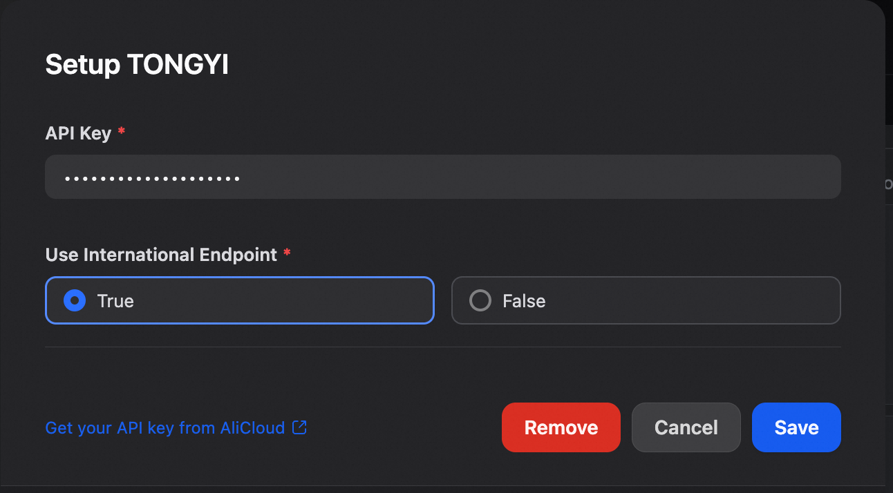

# Dify 通义千问插件

通义千问（Tongyi Qwen）是阿里巴巴云开发的大型语言模型系列，包含多个变体：Qwen 用于文本处理、Qwen-VL 用于视觉语言任务、Qwen-Audio 用于音频理解。该系列模型规模庞大，旗舰模型 Qwen-72B 拥有 720 亿参数，训练数据超过 3 万亿 token。

## 功能特性

- 支持多种模型类型（LLM、文本嵌入、重排序、语音转文字、文字转语音）
- **支持自定义 Base URL**，可连接私有部署或自定义端点
- 支持国际端点和国内端点切换
- 完整的 API 兼容性

## 配置说明

### 获取 API Key

1. 访问 [阿里云百炼控制台](https://bailian.console.aliyun.com/?apiKey=1#/api-key)
2. 创建并获取您的 API Key
3. 在 Dify 的「设置」->「模型供应商」中配置

### 配置选项

#### 必需配置

- **API Key**: 您的阿里云 API Key，从 [阿里云百炼控制台](https://bailian.console.aliyun.com/?apiKey=1#/api-key) 获取

#### 可选配置

- **Base URL**: 自定义 API 端点基础 URL
  - 可用于连接私有部署或自定义端点
  - 优先级高于「使用国际端点」设置
  - 示例：`https://dashscope.aliyuncs.com/api/v1`

- **使用国际端点**: 在国际端点和国内端点之间切换
  - `是`: 使用国际端点（`https://dashscope-intl.aliyuncs.com/api/v1`）
  - `否`: 使用国内端点（`https://dashscope.aliyuncs.com/api/v1`）
  - 仅在未设置 Base URL 时生效

### 端点优先级

插件按以下优先级选择 API 端点：

1. **自定义 Base URL**（如果已设置）
2. **国际端点**（如果「使用国际端点」设置为 `是`）
3. **默认国内端点**（兜底方案）

## 支持的模型类型

- **LLM（大语言模型）**: 文本生成、对话等任务
- **文本嵌入（Text Embedding）**: 文本向量化
- **重排序（Rerank）**: 文档重排序
- **语音转文字（Speech-to-Text）**: 语音识别
- **文字转语音（Text-to-Speech）**: 语音合成

## 使用说明

本插件为 Dify 平台上的通义千问模型插件，支持修改 Base URL 以连接自定义端点或私有部署环境。
